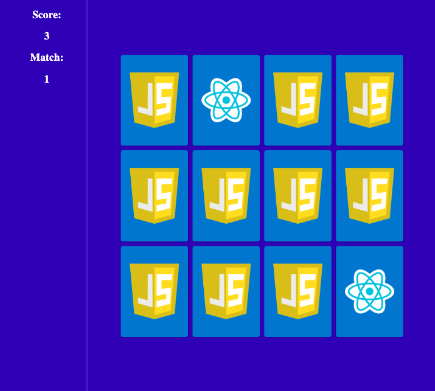

# Memory Card Game

> A small project with Vanilla JavaScript

Memory Card Game, also known as Matching Pairs, is a card game in which all of the cards are laid face down on a surface and two cards are flipped face up over each turn. The object of the game is to turn over pairs of matching cards.

## This projects covers how to:
- select elements in the DOM with querySelector
- iterate through lists with forEach
- add/remove an element class
- add/remove event listeners
- timeout
- html5: data-attribute
- css3: positioning, flexbox, perspective, backface-visibility, transitions

### Design

